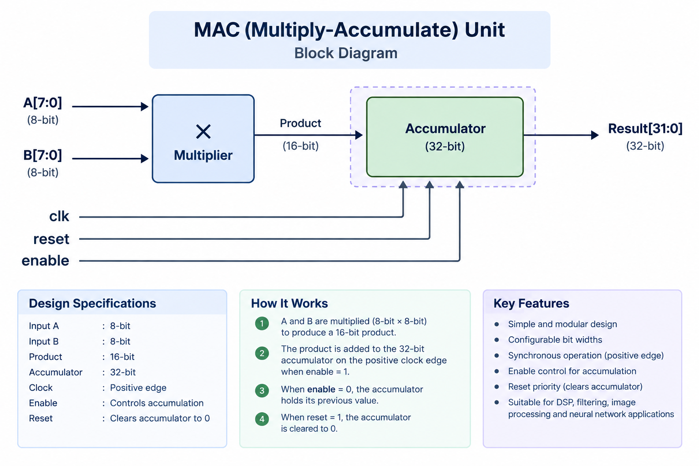

# 8-bit Multiply-Accumulate (MAC) Unit

A simple RTL implementation of an 8-bit × 8-bit Multiply-Accumulate (MAC) unit using Verilog.

## Overview

A MAC unit multiplies two input values and adds the resulting product to a stored accumulator value on each enabled positive clock edge.

In simple terms:

**Multiply → Add to previous result → Store**
## Architecture

## Design Specifications

| Parameter | Specification |
|---|---|
| Input A | 8-bit |
| Input B | 8-bit |
| Product | 16-bit |
| Accumulator | 32-bit |
| Result | 32-bit |
| Clock | Positive edge |
| Enable | Controls accumulation |
| Reset | Clears accumulator to 0 |

## Operation

When `enable = 1`, the MAC calculates:

`Accumulator = Accumulator + (A × B)`

When `enable = 0`, the accumulator holds its previous value.

When `reset = 1`, the accumulator is cleared to `0`.

## Verification

The design was simulated and verified using:

- Icarus Verilog
- GTKWave

Test cases include:

- Basic multiplication
- Accumulation across clock cycles
- Enable/hold behavior
- Reset operation
- Maximum input case: `255 × 255 = 65025`
- Zero-input case
  
 ## Simulation
 The RTL design was simulated using Icarus Verilog and the waveforms were analysed using GTKWave.
 .png)
  

## Project Status

Functional RTL design and simulation verified successfully.
